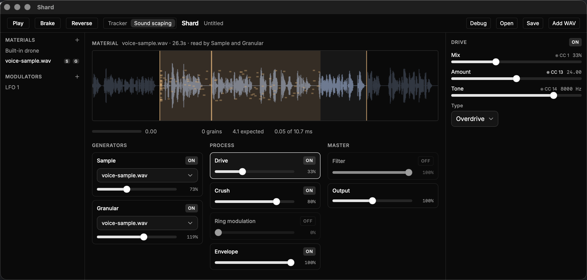

# Shard

Sample-shaping and sound-scaping.

A desktop app for macOS. Material goes through a grain cloud and a chain of
effects that break it, played from steps or left to run as a soundscape.



---

## Download

The latest zip is on [Releases](https://github.com/preset-nz/shard/releases). Free, pre-release, Apple Silicon (M-series) Macs only.

It isn't signed by Apple, so the first time macOS says **"Shard.app is damaged and can't be opened"**. It isn't damaged; macOS doesn't recognise the developer. Fix it once:

1. Open Terminal (`Cmd+Space`, type `Terminal`).
2. Type `xattr -cr ` (with a trailing space), drag `Shard.app` into the Terminal window, and press Return.
3. Double-click the app again. It opens from then on.

---

## Play it

The app opens with a built-in drone. Press Space and it loops, plain:
granular and the effects start switched off. Each section has its switch in
its header. Turn one on, set its Mix, and hear the before and after.

Material is WAV files, added to the list on the left and wired into the
sample player or the grain cloud.

`Cmd-S` saves a `.shard` file and `Cmd-O` opens one. `Cmd-,` opens Settings,
where MIDI controllers are set up.

**Saving**
A `.shard` file holds the sound and the steps that play it. Material stays
where it is on disk and the file points to it, so a file is a few kilobytes.
Move a sample and the file still opens, and says which one is missing.

---

## Build it

To build it from source instead:

**Prerequisites**
[Rust](https://rustup.rs), [Node](https://nodejs.org),
[pnpm](https://pnpm.io), [just](https://github.com/casey/just), Python 3,
and the Xcode Command Line Tools (`xcode-select --install`).
[SoX](https://sourceforge.net/projects/sox/) makes the starter material.
`just prep` reports what is installed.

```sh
just install     # dependencies
just material    # starter material, synthesised into assets/
just run         # the app
```

`just material` makes drones, metal, clicks and pitched-down speech on your
machine, so there is nothing to download and no licence to check.

`just build` makes a release bundle. `just check` runs the tests, linters and
licence gate.

---

## Licence

[MIT](LICENSE).
